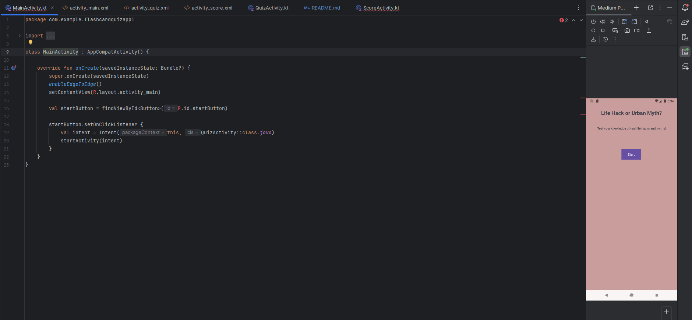
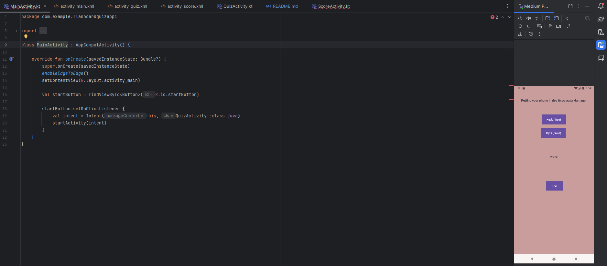
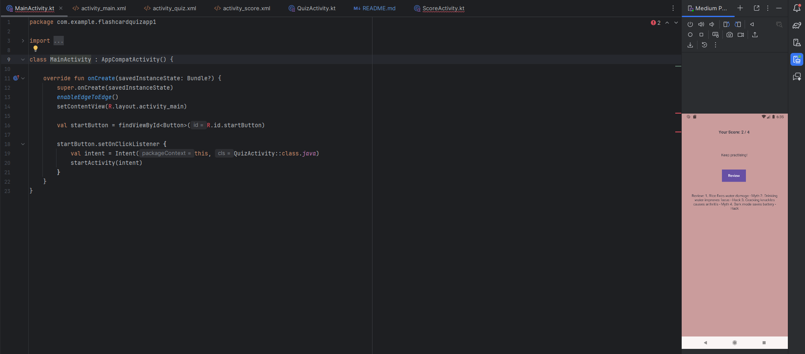

Flashcard Quiz App

This Android app is a flashcard quiz game that helps users differentiate between real life hacks and myths.

The goal is to improve critical thinking and help users identify misleading online advice.

Features
- Flashcard quiz system
- True/False selection
- Instant feedback per question
- Score tracking
- Final evaluation screen
- Review mode for learning

Technologies Used
- Kotlin
- Android Studio
- GitHub Version Control
- GitHub Actions (CI Build)

Screenshots

Here's a link to a video demonstrating how the app works: 
